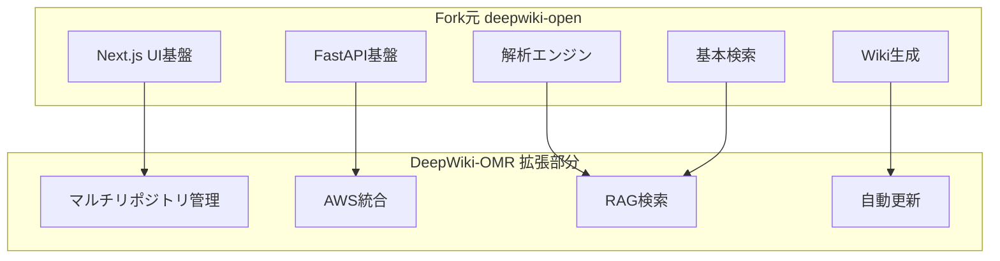
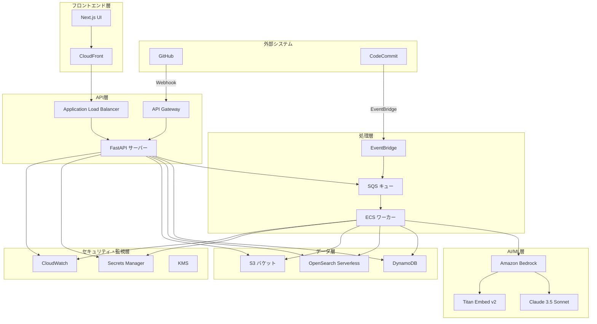
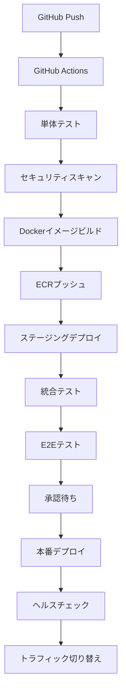

# 設計書

## 概要

DeepWiki-Open-MultiRepo（DeepWiki-OMR）は、既存のdeepwiki-open（https://github.com/AsyncFuncAI/deepwiki-open）をフォークベースとして拡張し、複数のGitリポジトリからAIを使用して自動的にWikiドキュメントを生成し、横断検索機能を提供するシステムです。

### フォーク元の活用方針

本システムは以下のdeepwiki-openの既存機能を最大限活用します：

- **フロントエンド基盤**: Next.js + React のUI基盤
- **バックエンド基盤**: FastAPI のAPI基盤  
- **基本的なWiki表示機能**: ページレンダリング、ナビゲーション
- **ソース解析エンジン**: AST解析、コード構造解析
- **基本的な検索機能**: 全文検索の基盤

### 拡張・改修対象

既存機能を以下の方向で拡張・改修します：

- **マルチリポジトリ対応**: 単一リポジトリから複数リポジトリ管理への拡張
- **AWS統合**: Bedrock、OpenSearch、DynamoDB等のAWSサービス統合
- **横断検索機能**: 複数リポジトリを対象とした検索機能の追加
- **RAG検索機能**: セマンティック検索とAI回答生成機能の追加
- **自動更新機能**: Webhook連携による自動更新機能の追加

本設計書では、AWSネイティブアーキテクチャを基盤とした、スケーラブルで安全かつ保守可能なシステムアーキテクチャを定義します。

## アーキテクチャ

### Fork元との関係性



### システム全体アーキテクチャ



### レイヤー構成

#### 1. プレゼンテーション層
- **Next.js フロントエンド**: React ベースのSPA
- **CloudFront**: CDN とキャッシング
- **Application Load Balancer**: トラフィック分散

#### 2. アプリケーション層
- **FastAPI サーバー**: REST API エンドポイント
- **API Gateway**: Webhook エンドポイント
- **ECS Fargate**: コンテナ実行環境

#### 3. ビジネスロジック層
- **リポジトリ管理サービス**: リポジトリのCRUD操作
- **解析サービス**: コード解析とWiki生成
- **検索サービス**: 全文検索とRAG検索
- **Webhook処理サービス**: 自動更新処理

#### 4. データアクセス層
- **DynamoDB**: メタデータ永続化
- **OpenSearch**: 検索インデックス
- **S3**: ファイルストレージ

#### 5. 外部統合層
- **Amazon Bedrock**: AI/ML サービス
- **GitHub/CodeCommit**: ソースリポジトリ

## コンポーネントとインターフェース

### フロントエンドコンポーネント

#### 既存コンポーネントの活用と拡張

**Fork元から流用するコンポーネント:**
- `WikiViewer`: 基本的なWiki表示機能
- `CodeRenderer`: ソースコード表示機能  
- `NavigationTree`: ファイルツリーナビゲーション
- `SearchBox`: 基本的な検索UI
- `MarkdownRenderer`: Markdownレンダリング機能

**新規追加・拡張するコンポーネント:**
```typescript
// リポジトリ管理コンポーネント（新規）
interface リポジトリ管理コンポーネント {
  リポジトリ一覧表示(): JSX.Element;
  リポジトリ登録フォーム(): JSX.Element;
  リポジトリ詳細表示(リポジトリID: string): JSX.Element;
  解析状況表示(リポジトリID: string): JSX.Element;
}

// Wiki表示コンポーネント（既存を拡張）
interface 拡張Wiki表示コンポーネント extends 既存WikiViewer {
  マルチリポジトリ対応Wiki目次表示(リポジトリID: string): JSX.Element;
  リポジトリ切り替えセレクター(): JSX.Element;
  横断リンク表示(): JSX.Element;
}

// 検索コンポーネント（既存を拡張）
interface 拡張検索コンポーネント extends 既存SearchBox {
  RAG検索フォーム(): JSX.Element;  // 新規追加
  横断検索結果表示(結果: 検索結果[]): JSX.Element;  // 拡張
  リポジトリフィルター(): JSX.Element;  // 新規追加
  引用表示コンポーネント(引用: 引用情報[]): JSX.Element;  // 新規追加
}
```

#### コンポーネント改修方針
```typescript
// 既存コンポーネントの改修例
// Before: 単一リポジトリ対応
interface 既存WikiViewer {
  displayWiki(path: string): JSX.Element;
}

// After: マルチリポジトリ対応に拡張
interface 拡張WikiViewer {
  displayWiki(repoId: string, path: string): JSX.Element;
  switchRepository(repoId: string): void;
  showCrossRepoLinks(currentPath: string): JSX.Element;
}
```

### バックエンドサービス

#### API エンドポイント設計

**Fork元から流用するAPI:**
- `/api/wiki/{path}`: 基本的なWiki取得API
- `/api/search`: 基本的な検索API  
- `/api/parse`: ソース解析API
- `/api/files/{path}`: ファイル取得API

**新規追加・拡張するAPI:**
```python
# リポジトリ管理API（新規）
class リポジトリAPI:
    async def リポジトリを登録(self, リポジトリ情報: リポジトリ登録リクエスト) -> リポジトリ登録レスポンス
    async def リポジトリ一覧を取得(self) -> List[リポジトリ情報]
    async def リポジトリ詳細を取得(self, リポジトリID: str) -> リポジトリ詳細
    async def リポジトリを削除(self, リポジトリID: str) -> 削除結果
    async def 解析を開始(self, リポジトリID: str, 解析種別: str) -> ジョブ開始結果

# 検索API（既存を拡張）
class 拡張検索API:
    # 既存機能を拡張
    async def 全文検索(self, クエリ: str, リポジトリIDs: List[str] = None) -> 検索結果
    # 新規追加
    async def RAG検索(self, 質問: str, リポジトリIDs: List[str] = None) -> RAG検索結果
    async def 横断検索(self, クエリ: str) -> 横断検索結果

# WikiAPI（既存を拡張）
class 拡張WikiAPI:
    # 既存: /api/wiki/{path} を拡張
    async def Wiki目次を取得(self, リポジトリID: str) -> Wiki目次
    async def Wikiページを取得(self, リポジトリID: str, ページID: str) -> Wikiページ
    # 新規追加
    async def マルチリポジトリWiki目次を取得(self) -> マルチリポジトリWiki目次

# WebhookAPI（新規）
class WebhookAPI:
    async def GitHub_Webhook処理(self, ペイロード: dict, 署名: str) -> Webhook処理結果
    async def CodeCommit_Webhook処理(self, イベント: dict) -> Webhook処理結果
```

#### 既存APIの改修方針
```python
# 既存APIの改修例
# Before: 単一リポジトリ前提
@app.get("/api/wiki/{path}")
async def get_wiki(path: str):
    return await wiki_service.get_wiki_content(path)

# After: マルチリポジトリ対応
@app.get("/api/repos/{repo_id}/wiki/{path}")
async def get_wiki(repo_id: str, path: str):
    return await wiki_service.get_wiki_content(repo_id, path)

# 後方互換性のため既存エンドポイントも維持
@app.get("/api/wiki/{path}")
async def get_wiki_legacy(path: str):
    # デフォルトリポジトリまたは最初のリポジトリを使用
    default_repo = await repo_service.get_default_repository()
    return await wiki_service.get_wiki_content(default_repo.id, path)
```

#### サービス層設計

**Fork元から流用するサービス:**
- `WikiService`: 基本的なWiki生成・表示サービス
- `ParseService`: ソースコード解析サービス
- `FileService`: ファイル操作サービス
- `SearchService`: 基本的な検索サービス

**新規追加・拡張するサービス:**
```python
# リポジトリ管理サービス（新規）
class リポジトリ管理サービス:
    def __init__(self, リポジトリ: リポジトリリポジトリ):
        self.リポジトリ = リポジトリ
    
    async def リポジトリを登録(self, プロバイダー: str, URL: str, 表示名: str) -> 登録結果:
        # URL妥当性検証
        # リポジトリ情報作成
        # データベース保存
        pass
    
    async def 解析ジョブを開始(self, リポジトリID: str, 種別: 解析種別) -> ジョブ結果:
        # SQSにジョブメッセージ送信
        pass

# 解析サービス（既存ParseServiceを拡張）
class 拡張解析サービス(既存ParseService):
    def __init__(self, 
                 Git操作: Git操作サービス,
                 AI処理: AI処理サービス,
                 ストレージ: ストレージサービス,
                 既存解析: 既存ParseService):
        super().__init__()
        self.Git操作 = Git操作
        self.AI処理 = AI処理
        self.ストレージ = ストレージ
        self.既存解析 = 既存解析
    
    async def リポジトリを解析(self, リポジトリID: str, 種別: 解析種別) -> 解析結果:
        # 1. リポジトリクローン
        # 2. 既存のファイル解析機能を活用
        解析結果 = await self.既存解析.parse_repository(リポジトリパス)
        # 3. 新規: 埋め込み生成
        # 4. 新規: Wiki生成（Bedrock Claude使用）
        # 5. 新規: インデックス更新（OpenSearch）
        pass

# 検索サービス（既存SearchServiceを拡張）
class 拡張検索サービス(既存SearchService):
    def __init__(self, 
                 OpenSearch: OpenSearchクライアント,
                 AI処理: AI処理サービス,
                 既存検索: 既存SearchService):
        super().__init__()
        self.OpenSearch = OpenSearch
        self.AI処理 = AI処理
        self.既存検索 = 既存検索
    
    async def 全文検索を実行(self, クエリ: str, フィルター: 検索フィルター) -> 検索結果:
        # 既存の検索機能を拡張してマルチリポジトリ対応
        if フィルター.リポジトリIDs:
            return await self.マルチリポジトリ検索(クエリ, フィルター.リポジトリIDs)
        else:
            # 既存機能を活用
            return await self.既存検索.search(クエリ)
    
    async def RAG検索を実行(self, 質問: str, フィルター: 検索フィルター) -> RAG検索結果:
        # 新規機能: RAG検索
        # 1. 質問の埋め込み生成
        # 2. ベクトル検索
        # 3. コンテキスト構築
        # 4. Claude回答生成
        pass

# Wikiサービス（既存WikiServiceを拡張）
class 拡張Wikiサービス(既存WikiService):
    def __init__(self, 既存Wiki: 既存WikiService, S3クライアント):
        super().__init__()
        self.既存Wiki = 既存Wiki
        self.S3クライアント = S3クライアント
    
    async def マルチリポジトリWikiを生成(self, リポジトリID: str) -> Wiki生成結果:
        # 既存のWiki生成機能を活用
        基本Wiki = await self.既存Wiki.generate_wiki(ソースパス)
        # 新規: S3保存、メタデータ管理
        return await self.S3にWikiを保存(リポジトリID, 基本Wiki)
```

## データモデル

### DynamoDB テーブル設計

#### リポジトリテーブル (deepwiki_repos)
```json
{
  "TableName": "deepwiki-omr-repos",
  "KeySchema": [
    {
      "AttributeName": "repo_id",
      "KeyType": "HASH"
    }
  ],
  "AttributeDefinitions": [
    {
      "AttributeName": "repo_id",
      "AttributeType": "S"
    },
    {
      "AttributeName": "status",
      "AttributeType": "S"
    }
  ],
  "GlobalSecondaryIndexes": [
    {
      "IndexName": "status-index",
      "KeySchema": [
        {
          "AttributeName": "status",
          "KeyType": "HASH"
        }
      ]
    }
  ]
}
```

#### ページテーブル (deepwiki_pages)
```json
{
  "TableName": "deepwiki-omr-pages",
  "KeySchema": [
    {
      "AttributeName": "repo_id",
      "KeyType": "HASH"
    },
    {
      "AttributeName": "page_id",
      "KeyType": "RANGE"
    }
  ],
  "AttributeDefinitions": [
    {
      "AttributeName": "repo_id",
      "AttributeType": "S"
    },
    {
      "AttributeName": "page_id",
      "AttributeType": "S"
    }
  ]
}
```

#### ジョブテーブル (deepwiki_jobs)
```json
{
  "TableName": "deepwiki-omr-jobs",
  "KeySchema": [
    {
      "AttributeName": "job_id",
      "KeyType": "HASH"
    }
  ],
  "AttributeDefinitions": [
    {
      "AttributeName": "job_id",
      "AttributeType": "S"
    },
    {
      "AttributeName": "repo_id",
      "AttributeType": "S"
    },
    {
      "AttributeName": "status",
      "AttributeType": "S"
    }
  ],
  "GlobalSecondaryIndexes": [
    {
      "IndexName": "repo-status-index",
      "KeySchema": [
        {
          "AttributeName": "repo_id",
          "KeyType": "HASH"
        },
        {
          "AttributeName": "status",
          "KeyType": "RANGE"
        }
      ]
    }
  ]
}
```

### OpenSearch インデックス設計

#### ドキュメントインデックス
```json
{
  "settings": {
    "index": {
      "knn": true,
      "number_of_shards": 1,
      "number_of_replicas": 0
    },
    "analysis": {
      "analyzer": {
        "japanese_analyzer": {
          "type": "custom",
          "tokenizer": "kuromoji_tokenizer",
          "filter": ["kuromoji_baseform", "kuromoji_part_of_speech", "cjk_width", "lowercase"]
        }
      }
    }
  },
  "mappings": {
    "properties": {
      "repo_id": {
        "type": "keyword"
      },
      "source_path": {
        "type": "keyword"
      },
      "title": {
        "type": "text",
        "fields": {
          "japanese": {
            "type": "text",
            "analyzer": "japanese_analyzer"
          }
        }
      },
      "chunk": {
        "type": "text",
        "fields": {
          "japanese": {
            "type": "text",
            "analyzer": "japanese_analyzer"
          }
        }
      },
      "vector": {
        "type": "knn_vector",
        "dimension": 1024,
        "method": {
          "name": "hnsw",
          "space_type": "cosinesimil"
        }
      },
      "updated_at": {
        "type": "date"
      },
      "file_type": {
        "type": "keyword"
      },
      "language": {
        "type": "keyword"
      }
    }
  }
}
```

### S3 バケット構造

```
deepwiki-omr-content/
├── repos/
│   └── {repo_id}/
│       ├── wiki/
│       │   ├── index.json          # Wiki目次
│       │   ├── pages/
│       │   │   ├── {page_id}.md    # Wikiページ
│       │   │   └── {page_id}.html  # レンダリング済みHTML
│       │   └── assets/
│       │       ├── images/
│       │       └── diagrams/
│       ├── raw/
│       │   └── {commit_sha}/       # 元ファイル
│       └── analysis/
│           ├── ast/                # AST解析結果
│           └── embeddings/         # 埋め込みデータ
└── temp/
    └── {job_id}/                   # 一時ファイル
```

## エラーハンドリング

### エラー分類と処理戦略

#### システムエラー
```python
class システムエラー(Exception):
    """システム内部エラーの基底クラス"""
    pass

class データベースエラー(システムエラー):
    """データベース関連エラー"""
    def __init__(self, メッセージ: str, 詳細: dict = None):
        self.メッセージ = メッセージ
        self.詳細 = 詳細 or {}
        super().__init__(メッセージ)

class 外部サービスエラー(システムエラー):
    """外部サービス呼び出しエラー"""
    def __init__(self, サービス名: str, エラーコード: str, メッセージ: str):
        self.サービス名 = サービス名
        self.エラーコード = エラーコード
        self.メッセージ = メッセージ
        super().__init__(f"{サービス名}: {メッセージ}")
```

#### ビジネスエラー
```python
class ビジネスエラー(Exception):
    """ビジネスロジックエラーの基底クラス"""
    pass

class リポジトリ登録エラー(ビジネスエラー):
    """リポジトリ登録時のエラー"""
    pass

class 解析エラー(ビジネスエラー):
    """解析処理時のエラー"""
    pass
```

#### エラーハンドリング戦略
```python
class エラーハンドラー:
    def __init__(self, ログ出力: ログサービス, 監視: 監視サービス):
        self.ログ出力 = ログ出力
        self.監視 = 監視
    
    async def システムエラーを処理(self, エラー: システムエラー, コンテキスト: dict):
        # 1. エラーログ出力
        await self.ログ出力.エラーを記録(エラー, コンテキスト)
        
        # 2. メトリクス更新
        await self.監視.エラーメトリクスを更新(エラー.__class__.__name__)
        
        # 3. アラート送信（重要度に応じて）
        if isinstance(エラー, データベースエラー):
            await self.監視.緊急アラートを送信(エラー)
        
        # 4. 再試行判定
        return self.再試行可能か判定(エラー)
    
    def 再試行可能か判定(self, エラー: Exception) -> bool:
        再試行可能エラー = [
            外部サービスエラー,
            一時的なネットワークエラー,
            レート制限エラー
        ]
        return any(isinstance(エラー, 型) for 型 in 再試行可能エラー)
```

### 再試行メカニズム
```python
class 再試行処理:
    def __init__(self, 最大試行回数: int = 3, 基本待機時間: float = 1.0):
        self.最大試行回数 = 最大試行回数
        self.基本待機時間 = 基本待機時間
    
    async def 指数バックオフで実行(self, 処理: Callable, *引数, **キーワード引数):
        for 試行回数 in range(self.最大試行回数):
            try:
                return await 処理(*引数, **キーワード引数)
            except Exception as エラー:
                if 試行回数 == self.最大試行回数 - 1:
                    raise エラー
                
                if not self.再試行可能(エラー):
                    raise エラー
                
                待機時間 = self.基本待機時間 * (2 ** 試行回数)
                await asyncio.sleep(待機時間)
    
    def 再試行可能(self, エラー: Exception) -> bool:
        # 再試行可能なエラーかどうかを判定
        pass
```

## テスト戦略

### テストレベル

#### 単体テスト
- **対象**: 個別のサービス、関数、コンポーネント
- **ツール**: pytest (Python), Jest (TypeScript)
- **カバレッジ目標**: 80%以上
- **モック対象**: 外部サービス、データベース

#### 統合テスト
- **対象**: API エンドポイント、サービス間連携
- **ツール**: pytest + TestClient, Testcontainers
- **環境**: Docker Compose による統合環境
- **データ**: テスト専用データベース

#### E2Eテスト
- **対象**: ユーザーシナリオ全体
- **ツール**: Playwright
- **環境**: ステージング環境
- **シナリオ**: リポジトリ登録→解析→検索→Wiki閲覧

### テスト自動化パイプライン


### パフォーマンステスト
```python
# Locustを使用した負荷テスト設定
class DeepWikiOMR負荷テスト(HttpUser):
    wait_time = between(1, 3)
    
    @task(3)
    def 全文検索テスト(self):
        self.client.get("/search?q=function&repo_ids=repo-001")
    
    @task(1)
    def RAG検索テスト(self):
        self.client.post("/search/rag", json={
            "質問": "このコードの機能を説明して",
            "repo_ids": ["repo-001"]
        })
    
    @task(2)
    def Wiki表示テスト(self):
        self.client.get("/repos/repo-001/wiki")
```

## セキュリティ設計

### 認証・認可

#### 段階的セキュリティ実装
```python
# Phase 1: トークンベース認証
class トークン認証:
    def __init__(self, 秘密鍵: str):
        self.秘密鍵 = 秘密鍵
    
    def トークンを生成(self, ユーザーID: str, 権限: List[str]) -> str:
        ペイロード = {
            "user_id": ユーザーID,
            "permissions": 権限,
            "exp": datetime.utcnow() + timedelta(hours=24)
        }
        return jwt.encode(ペイロード, self.秘密鍵, algorithm="HS256")
    
    def トークンを検証(self, トークン: str) -> dict:
        return jwt.decode(トークン, self.秘密鍵, algorithms=["HS256"])

# Phase 2: Cognito統合（将来実装）
class Cognito認証:
    def __init__(self, ユーザープールID: str, クライアントID: str):
        self.ユーザープールID = ユーザープールID
        self.クライアントID = クライアントID
    
    async def JWTを検証(self, トークン: str) -> ユーザー情報:
        # Cognito JWT検証ロジック
        pass
```

### Webhook セキュリティ
```python
class Webhook署名検証:
    def __init__(self, 署名キー: str):
        self.署名キー = 署名キー
    
    def GitHub署名を検証(self, ペイロード: bytes, 署名: str) -> bool:
        期待署名 = hmac.new(
            self.署名キー.encode(),
            ペイロード,
            hashlib.sha256
        ).hexdigest()
        return hmac.compare_digest(f"sha256={期待署名}", 署名)
    
    def CodeCommit署名を検証(self, イベント: dict) -> bool:
        # EventBridge署名検証ロジック
        pass
```

### データ暗号化
```python
class 暗号化サービス:
    def __init__(self, KMSキーID: str):
        self.KMSキーID = KMSキーID
        self.KMSクライアント = boto3.client('kms')
    
    async def データを暗号化(self, 平文: str) -> str:
        レスポンス = await self.KMSクライアント.encrypt(
            KeyId=self.KMSキーID,
            Plaintext=平文.encode()
        )
        return base64.b64encode(レスポンス['CiphertextBlob']).decode()
    
    async def データを復号化(self, 暗号文: str) -> str:
        暗号化バイト = base64.b64decode(暗号文.encode())
        レスポンス = await self.KMSクライアント.decrypt(
            CiphertextBlob=暗号化バイト
        )
        return レスポンス['Plaintext'].decode()
```

## 監視・ログ設計

### ログ設計
```python
class 構造化ログ:
    def __init__(self, サービス名: str):
        self.サービス名 = サービス名
        self.ログ出力 = structlog.get_logger()
    
    async def 情報ログ(self, メッセージ: str, **追加情報):
        await self.ログ出力.info(
            メッセージ,
            service=self.サービス名,
            timestamp=datetime.utcnow().isoformat(),
            **追加情報
        )
    
    async def エラーログ(self, エラー: Exception, コンテキスト: dict = None):
        await self.ログ出力.error(
            str(エラー),
            service=self.サービス名,
            error_type=エラー.__class__.__name__,
            stack_trace=traceback.format_exc(),
            context=self.機密情報をマスク(コンテキスト or {}),
            timestamp=datetime.utcnow().isoformat()
        )
    
    def 機密情報をマスク(self, データ: dict) -> dict:
        マスク対象 = ['password', 'token', 'secret', 'key']
        マスク済み = データ.copy()
        for キー in マスク済み:
            if any(対象 in キー.lower() for 対象 in マスク対象):
                マスク済み[キー] = "***MASKED***"
        return マスク済み
```

### メトリクス設計
```python
class メトリクス収集:
    def __init__(self):
        self.CloudWatchクライアント = boto3.client('cloudwatch')
    
    async def API応答時間を記録(self, エンドポイント: str, 応答時間: float):
        await self.CloudWatchクライアント.put_metric_data(
            Namespace='DeepWiki-OMR/API',
            MetricData=[
                {
                    'MetricName': 'ResponseTime',
                    'Dimensions': [
                        {
                            'Name': 'Endpoint',
                            'Value': エンドポイント
                        }
                    ],
                    'Value': 応答時間,
                    'Unit': 'Seconds'
                }
            ]
        )
    
    async def エラー率を記録(self, サービス名: str, エラー数: int, 総リクエスト数: int):
        エラー率 = (エラー数 / 総リクエスト数) * 100 if 総リクエスト数 > 0 else 0
        await self.CloudWatchクライアント.put_metric_data(
            Namespace='DeepWiki-OMR/Errors',
            MetricData=[
                {
                    'MetricName': 'ErrorRate',
                    'Dimensions': [
                        {
                            'Name': 'Service',
                            'Value': サービス名
                        }
                    ],
                    'Value': エラー率,
                    'Unit': 'Percent'
                }
            ]
        )
```

### アラート設定
```yaml
CloudWatch アラーム:
  API応答時間アラート:
    メトリクス: DeepWiki-OMR/API/ResponseTime
    閾値: 5秒
    期間: 5分
    評価期間: 2回連続
    アクション: SNS通知
  
  エラー率アラート:
    メトリクス: DeepWiki-OMR/Errors/ErrorRate
    閾値: 5%
    期間: 5分
    評価期間: 1回
    アクション: SNS通知 + Lambda自動対応
  
  DLQメッセージ蓄積アラート:
    メトリクス: AWS/SQS/ApproximateNumberOfMessages
    閾値: 10メッセージ
    期間: 1分
    評価期間: 1回
    アクション: 緊急SNS通知
```

## デプロイメント設計

### インフラストラクチャ as Code
```yaml
# AWS CDK構成例
スタック構成:
  - ネットワークスタック: VPC, サブネット, セキュリティグループ
  - データスタック: DynamoDB, OpenSearch, S3
  - コンピュートスタック: ECS, ALB, API Gateway
  - セキュリティスタック: IAM, Secrets Manager, KMS
  - 監視スタック: CloudWatch, X-Ray
```

### CI/CDパイプライン


### ブルーグリーンデプロイ戦略
```python
class デプロイメント管理:
    def __init__(self, ECSクライアント, ALBクライアント):
        self.ECSクライアント = ECSクライアント
        self.ALBクライアント = ALBクライアント
    
    async def ブルーグリーンデプロイを実行(self, 新バージョン: str):
        # 1. 新環境（グリーン）作成
        グリーン環境 = await self.新環境を作成(新バージョン)
        
        # 2. ヘルスチェック
        if not await self.ヘルスチェック(グリーン環境):
            await self.環境を削除(グリーン環境)
            raise Exception("ヘルスチェック失敗")
        
        # 3. トラフィック段階的切り替え
        await self.トラフィックを段階的に切り替え(グリーン環境)
        
        # 4. 旧環境（ブルー）削除
        await self.旧環境を削除()
```

この設計書は、DeepWiki-OMRシステムの包括的な技術設計を提供し、要件定義書で定義されたすべての機能要件と非機能要件を満たすアーキテクチャを定義しています。