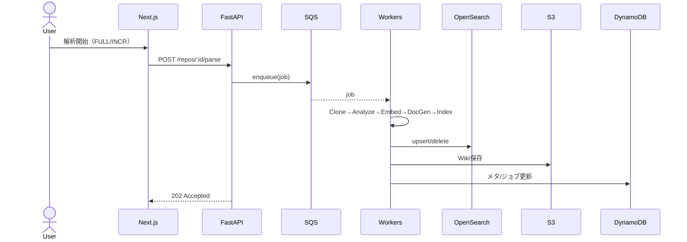
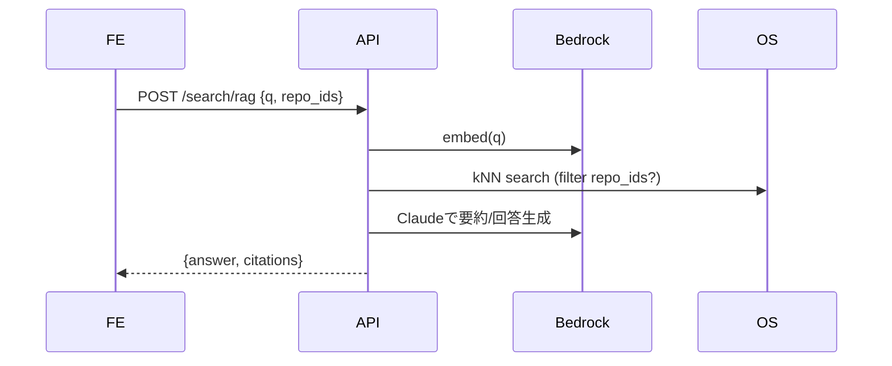
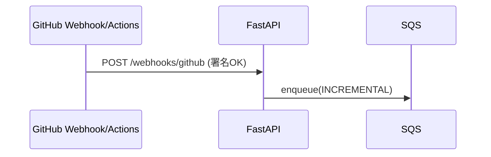

# 要件定義書（統合ブラッシュアップ版 v2）

> 本ドキュメントは `deepwiki-open` の **fork ベース**で拡張する要件定義です。  
> 既定は **AWSネイティブ**構成・**Bedrock Claude**・**複数リポ横断検索/RAG**・**手動/自動更新**を満たします。

## 1. 目的

- 複数のGitリポジトリからコードを取得・解析し、**自動Wiki化**・**横断検索（全文/RAG）**を提供。
    
- **AWSネイティブ**でスケーラブルかつ運用容易な基盤に最適化。
    
- **Bedrock経由のAnthropic Claude**を標準LLMとし、**セキュアな自動更新**（pushトリガー）を実現。
    

## 2. 前提・スコープ

- フォーク元を尊重：**Frontend = Next.js（React）／Backend = FastAPI** を踏襲。
    
- ソース取得：**GitHub**＋**AWS CodeCommit** をサポート（Private含む）。
    
- 検索：**OpenSearch Serverless** を既定（全文＋ベクトル）。Kendraは代替案。
    
- 埋め込み：**Bedrock Titan-Embed v2** を既定（※次元数は採用モデルに準拠、例：1024/1536のいずれか。実装時に確定）。
    
- 解析パイプラインは**非同期実行**（SQS＋Workers）。差分解析（INCREMENTAL）を標準化。
    
- 認証・認可は**段階的導入**：Phase1はWebhook署名/トークン＋管理者UIトークン、Phase2でCognito/RBAC。
    

## 3. 推奨技術（俯瞰）

|カテゴリ|既定|備考/代替|
|---|---|---|
|クラウド|AWS|—|
|コンピュート|ECS Fargate（API/Workers）|代替：Lambda/App Runner|
|LLM生成|Bedrock Claude（例：Claude 3.5 Sonnet）|—|
|埋め込み|Bedrock Titan-Embed v2|代替：Cohere Embed on Bedrock|
|全文/ベクトル検索|OpenSearch Serverless|代替：Kendra（QA特化。費用/制約に注意）、Aurora+pgvector（運用負担増）|
|メタ/状態|DynamoDB|代替：Aurora Serverless|
|成果物（Wiki/図/中間）|S3|—|
|キュー/再試行|SQS + DLQ|—|
|イベント連携|EventBridge|CodeCommit連携・スケジュール再解析|
|秘密情報|Secrets Manager|PAT/GitHub App/署名等|
|監視|CloudWatch Logs/Metrics|—|

## 4. 機能要件

### 4.1 リポジトリ管理

- **登録**：`provider (github|codecommit)`, `remote_url`, `display_name`, `branch?`
    
    - GitHub: `https://github.com/<org>/<repo>.git`
        
    - CodeCommit: `codecommit://<repo>` / `codecommit::<region>://<repo>` / `https://git-codecommit.<region>.amazonaws.com/v1/repos/<name>`
        
- **一覧/詳細/削除**（論理削除）
    
- 解析状態（`READY|PARSING|FAILED`）、最終コミットSHA/時刻の保持。
    

### 4.2 解析（Wiki化）パイプライン

- **手動実行**：`FULL` / `INCREMENTAL` を指定可能。
    
- **差分解析**：`git diff --name-status <last_sha>..HEAD` に基づき、追加/更新/削除を反映。
    
- **処理段**：Clone → Analyze（AST/章立て）→ Embed（Bedrock）→ DocGen（Claude）→ Index（OpenSearch）→ 保存（S3）→ メタ更新（DDB）。
    
- **非同期**：APIはSQSにジョブ投入、Workersが実行。失敗はDLQ。リトライ/再実行あり。
    

### 4.3 Wiki閲覧

- **UIでリポ選択**→当該RepoのWiki表示（目次/パンくず/ページ）。
    
- 生成物はS3、目次/ページメタはDDBから提供。
    

### 4.4 検索（横断）

- **通常検索**（全文）：OpenSearch BM25、`repo_id` フィルタ可能（All/複数）。
    
- **RAG検索**（横断）：クエリを埋め込み→kNN検索→上位kをコンテキストにClaudeで回答生成。
    
    - 最低3件の出典（ファイル/パス/リンク）を回答に付与。
        
    - `repo_id` 指定なしで全リポ横断。
        

### 4.5 追加・更新（UI）

- **追加**：URL/Provider/Branchを入力し「解析開始」で非同期ジョブ起動。進捗（Clone/Analyze/Embed/DocGen/Index）を表示。
    
- **手動更新**：「更新確認」→差分ありならINCREMENTAL解析ボタンを提示。
    

### 4.6 自動更新（pushトリガー）

- **GitHub**：Webhook or Actions → `/webhooks/github`。署名/トークン検証必須。
    
- **CodeCommit**：EventBridge（Repository State Change）→ API Gateway → `/webhooks/codecommit`。
    
- 受信後、対象`repo_id`特定→INCREMENTAL解析をSQS投入。
    

## 5. 非機能要件（NFR）

- **性能**：通常検索 p95 < 1.0s、RAG検索 p95 < 4.0s（k=12想定、要調整）。
    
- **可用性/拡張性**：ECS Fargate水平方向スケール、OpenSearch Serverless活用。
    
- **セキュリティ**：Secrets/KMS、IAM最小権限（Bedrock InvokeModel/OS/S3/DDB/SQS）、Webhook署名検証、ログの秘匿値マスキング。
    
- **運用/監視**：CloudWatch（ジョブ成功率/失敗率、レイテンシ、DLQ監視）、コスト可視化（Bedrock/OS/S3）。
    
- **国際化**：日英混在を想定し、OpenSearchのマッピングはmulti-field（simple＋日本語形態素など）検討。
    

## 6. データモデル（例）

### 6.1 DynamoDB

- **`deepwiki_repos`**（PK:`repo_id`）
    
    - `provider`, `remote_url`, `display_name`, `default_branch`
        
    - `status`, `last_scan_sha`, `last_scan_at`
        
- **`deepwiki_pages`**（PK:`repo_id`, SK:`page_id`）
    
    - `title`, `path`, `section`, `tokens`, `updated_at`
        
- **`deepwiki_jobs`**（PK:`job_id`, GSI:`repo_id`, `status`）
    
    - `type (FULL|INCREMENTAL)`, `trigger (manual|webhook|schedule)`, `started_at`, `ended_at`, `result`, `error?`
        

### 6.2 OpenSearch（既定マッピング）

```json
{
  "settings": { "index": { "knn": true } },
  "mappings": {
    "properties": {
      "repo_id":    { "type": "keyword" },
      "source_path":{ "type": "keyword" },
      "title":      { "type": "text" },
      "chunk":      { "type": "text" },
      "vector":     { "type": "knn_vector", "dimension": <EMBED_DIM> },
      "updated_at": { "type": "date" }
    }
  }
}
```

> `<EMBED_DIM>` は採用埋め込みの次元数に合わせる（Titan-Embed v2の仕様に準拠）。

### 6.3 S3

```
s3://<bucket>/<repo_id>/wiki/*.md|.html|.json
s3://<bucket>/<repo_id>/diagrams/*
s3://<bucket>/<repo_id>/raw/*
```

## 7. 外部インターフェース（REST）

- `POST /repos`：登録 `{ provider, remote_url, display_name, branch? }`
    
- `GET /repos`：一覧
    
- `POST /repos/{id}/parse`：解析実行 `{ type: FULL|INCREMENTAL }`
    
- `POST /repos/{id}/refresh`：更新確認→差分解析
    
- `GET /repos/{id}/wiki`：Wiki目次/メタ
    
- `GET /search?q=...&repo_ids[]=...`：全文横断
    
- `POST /search/rag`：RAG横断 `{ q, repo_ids?, top_k? }`
    
- `POST /webhooks/github` / `/webhooks/codecommit`：pushトリガー受付（署名/トークン必須）
    

## 8. UI要件（主要コンポーネント）

- **Repoセレクタ**（状態/最終更新/フィルタ）
    
- **Repo追加モーダル**（provider/URL/branch）
    
- **Wikiビュー**（目次/パンくず/ページ）
    
- **検索タブ**（通常/RAG切替、対象Repo=All/複数）
    
- **操作ボタン**（解析、更新確認、再解析）
    
- **進捗/ログ**（ジョブのステータス可視化）
    

## 9. シーケンス（要点）

### 9.1 手動解析



### 9.2 RAG横断



### 9.3 自動更新（GitHub）



## 10. セキュリティ/運用

- **Secrets**：PAT/GitHub App/署名はSecrets Manager＋KMS。ログ出力はマスキング。
    
- **IAM最小権限**：Bedrock InvokeModel（Claude/Embed対象に限定）、S3/DDB/OS/SQS/EventBridge。
    
- **Webhook**：署名/トークン検証、IP allowlist（可能なら）/Rate Limit。
    
- **監視/アラート**：DLQ蓄積、Webhook検証失敗増加、OpenSearch 429/5xx、RAG/通常検索レイテンシ異常。
    

## 11. 受け入れ基準（主要）

- 複数リポ登録（GitHub/CodeCommit）・Wiki表示が可能。
    
- 全文検索：All/複数Repoでヒットし、ページ遷移可能。
    
- RAG検索：All/複数Repoで回答と**出典（>=3件）**を返す。
    
- 手動更新：差分検出→INCREMENTAL解析でWiki/Index反映。
    
- 自動更新：pushトリガーでINCREMENTALが自動実行。
    
- 性能：通常検索 p95<1.0s、RAG p95<4.0s（ステージング測定）。
    
- セキュリティ：Webhook署名検証ユニット/統合テスト合格、Secrets流出なし。
    

## 12. フェーズ分割（推奨）

- **Phase 1**：Bedrock接続、複数リポ管理、全文横断、手動解析/更新。
    
- **Phase 2**：RAG横断（OpenSearchベクトル）、差分解析最適化、Webhook自動更新。
    
- **Phase 3**：Cognito/RBAC、Kendra/pgvector等の代替実装評価、監査/コスト最適化。
    

## 13. リスクと対応

- **埋め込み次元の相違**：Index作り直し手順を準備。
    
- **巨大リポ/多数リポ**：ジョブ併走数制御、ページング解析、コールドスタート対策。
    
- **Bedrockコスト/レイテンシ**：k（コンテキスト件数）、max_tokens、temperatureのチューニング。
    
